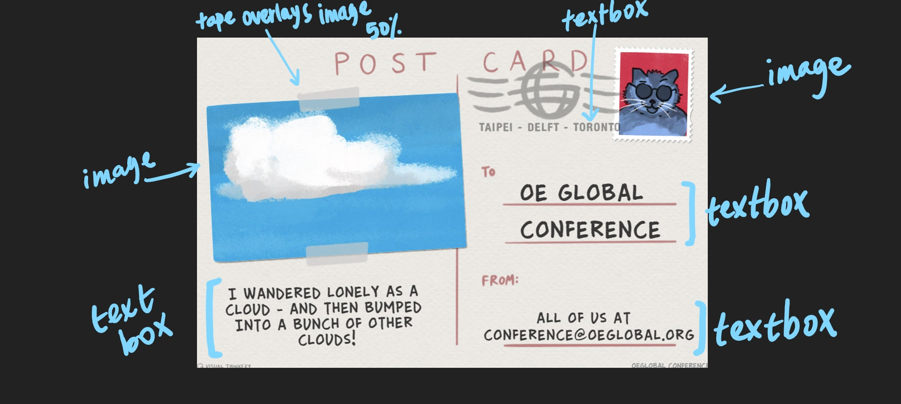

# Team notes
This is for maintaining communication about your team's working meetings to "ship" the project.

## Meeting notes
These are notes to be maintained PER date that you meet. What you did and what the next steps are
### Meeting Date

#### What we did:

#### What we'll do next

## Status check ins
These are dedicated status check-ins as this is a multi-week project
### Check-in 1
- What project / issue your picking (link to it)
https://github.com/elmsln/issues/issues/879
- A hand drawn / computer sketch / XD / some annotation visually of what needs to be done or what pieces get broken out. This could be drawn on over top of a screen shot of the item or a photo of whiteboard sketches. Whatever make the most sense to you.

- Initial questions / unknowns
 Are we making exact replicates of the post card or just have to have the same elements as the example?
 
- What elements do you expect are needed for this design?
Images, textboxes, background image, border for images

- What properties do you expect these to have?
Images: Image and alt text (slot)
Textboxes: slot
Background image: Title

- Slots?
 Yes, for the textboxes and images

- What CSS / Styling unknowns are there presently?
 Some elements overlay other elements. We are wondering if there is a CSS method that will allow us to choose which element overlays over which or if its just a matter of transparancy. 
 
- What states does it have? can you click / hover to engage with it?
Click on images: changes border. Left image: Tape becomes more transparent. Right image: Inner border of the background image appears. 
Click ont textboxes: Can edit text boxes

- What properties need mapped to HAX / the storybook? What can the user interact with?
 Images and textboxes

### Check-in 2
- 
- 
### Check-in 3
- 
- 
### Check-in 4
- 
- 
